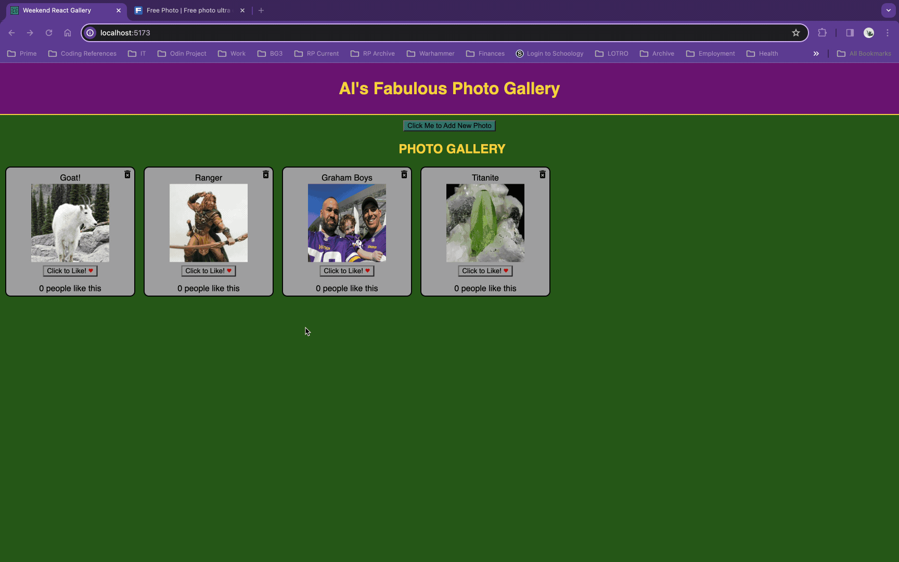

# WEEKEND-REACT-GALLERY

# Prime React Gallery Project Using React Framework

## Description

_Duration: 5 Days_

This project is a solution to the Prime Digital Academy weekend challenge of the same name. The end product meets all specs for baseline and stretch goals. The code challenge instructions are found [here](./INSTRUCTIONS.md).

This project involves a full stack application to organize and display a gallery of images and descriptions. This lightweight app accomplishes that and allows users to add photos by URL from the web or upload files that are stored locally on the host machine.

To complete this project I used the following checklist to break the problem down into steps.

Application Creation Steps

Base goal implementation

- [x] Create and Seed Initial Database in PostgreSQL
- [x] Create Server side server, router, and pool modules
- [x] Create and test server GET route
- [x] Create and test server PUT route
- [x] Create GalleryList component
- [x] Implement and test client GET route
- [x] Create GalleryItem component
- [x] Implement and test client PUT route (Like Button)
- [x] Implement photo/description toggle functionality

Stretch goal implementation

- [x] Create Header component
- [x] Create AddPhoto component
- [x] Create and test server POST route
- [x] Implement client form for AddPhoto
- [x] Create and test client POST route
- [x] Create and test server DELETE route
- [x] Add delete button to GalleryItem components
- [x] Implement and test client DELETE route
- [x] Add MUI styling (Grid display, delete button Icon, and like icon)
- [x] Create server side Multer file handling
- [x] Implement client side phoo upload form field
- [x] Implement, integrate, and test server and client upload POST routes

My initial strategy was to complete all functional tasks first, then go back and restyle to make it visually appealing (function over form). In reality it turned out to be a more iterative process of incremental function, then form, then more function, then more form, etc...

The single greatest challenge of this project was understanding the Multer API and how file data is handled in the context of axios, AJAX, and express. Timing was also problematic as an uploaded photo GalleryItem would render before the file was finsihed uploading. I resolved this issue by adding a promise to the server POST route that would delay sending status until the file existed.

## Screen Shots

Base Function Screen Shot

Add a Photo from the Web Screenshot

Upload a Photo

### Prerequisites

- [Node.js](https://nodejs.org/en/)
- [express](https://expressjs.com/)
- [React](https://react.dev/)

## Installation

1. Open up your editor of choice and run an `npm install`
2. Initiate the server using `npm run server`
3. Initiate the client using `npm run client`
4. navigate to host ip and port in browser (e.g. `127.0.0.1:5173`)
5. Enjoy!!!

## Usage

- App will open and display all photos in the database, displaying photos by default, each in it's own card. The card also shows the number of likes, a `like button`, and `delete button` (trach icon).
- To toggle between photo and description on the card, `click` the photo or description.
- To like a photo, click on the `Click to Like!` button. The number of likes will increase.
- To delete a photo, click the `trashcan` icon. Deleting a photo removes it from the server and is permanent.
- To add a photo, click the `Click Me to Add New Photo` button. This will reveal the Add Photo form. This form can be hidden without losing inputs by clicking the `Click Me to Hide Photo Form`. Clear all form data by clicking the `Reset Form` button.
- There are two ways to add a photo, by entering a URL or by uploading a photo.
- URL Photo's

  - (REQUIRED) Enter a short title in the `Photo Title` field. This is a required field.
  - (REQUIRED) To add a photo by URL, enter the URL (web or local) into the `Photo Location` field. This is a required field.
  - Optionally, enter a photo description in the `Description` field.
  - When all fields are complete, click the `Submit Photo` button.

- Upload Photos
  - (REQUIRED) Enter a short title in the `Photo Title` field. This is a required field.
  - (REQUIRED) Click the `Choose File `button in the `Upload File` field. You will be presented with a file selcetion dialogue. Choose a single file to upload. Upon selection, the required `Photo Location` will auto-populate with with the path to where the file will be stored.
  - Optionally, enter a photo description in the `Description` field.
  - When all fields are complete, click the `Submit Photo` button.

## Built With

1. Server Side

- Node.js
- javascript
- express
- postgreSQL
- fs
- multer

2. Client Side

- HTML
- CSS
- javascript
- Axios
- React
- Material UI (a little)

## Acknowledgement

Thanks to [Prime Digital Academy](www.primeacademy.io) who equipped and helped me to make this application a reality.
